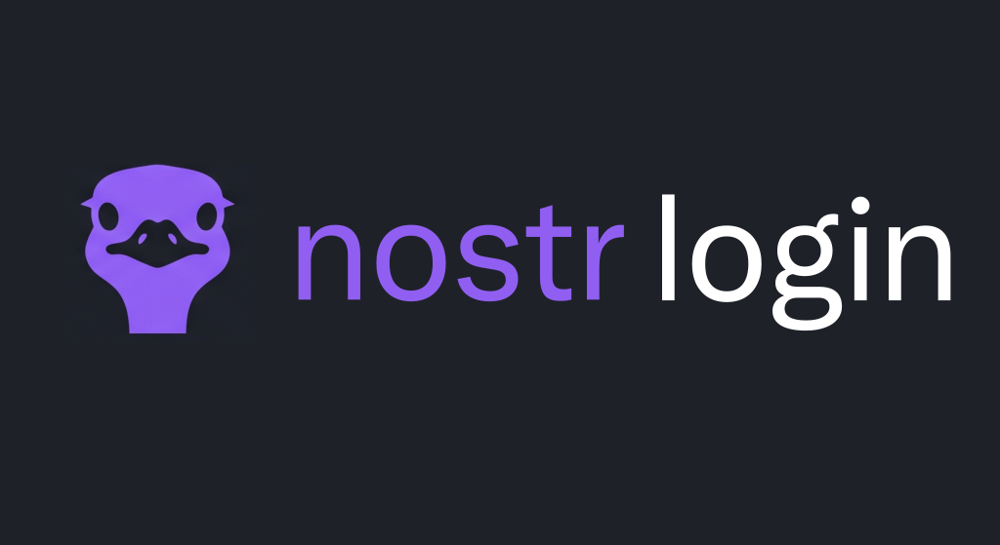

<p align="center">
  
</p>

# Nostr Login for BTCPay Server

This plugin lets users sign in to BTCPay Server with a **NIP-46 Nostr remote signer** (Nostr Connect) — scan a QR code with a signer app such as [Amber](https://github.com/greenart7c3/Amber), approve once, and you are logged in. No password, no email, and the private key never leaves the signer.

It is **purely additive**: "Sign in with Nostr" appears as a third option next to Passkey and LoginCode, and password sign-in keeps working.

## Usage

1. Install the plugin by navigating to your BTCPay Server > Server Settings > Plugins, find "Nostr Login" in
   Available Plugins, install it, and restart your server.
   a. Nostr Login requires BTCPay Server v2.4.2 or newer.
   b. The plugin is additive — it does not disable or replace password, Passkey, or LoginCode sign-in.
2. Link a Nostr key to your account: navigate to Account > Nostr, click "Link a Nostr key", and scan the QR code
   with a NIP-46 signer app (e.g. Amber). Approve the request to prove possession of the key.
3. Sign out, then on the login page choose **NostrConnect** (next to Passkey and LoginCode).
4. A QR code is displayed. Scan it with your signer app and approve the sign-in request. You are logged in — the
   plugin issues the standard BTCPay session cookie.
5. Admins can configure the plugin under Server Settings > Nostr Login: set the relays used for sign-in and
   optionally allow account creation via Nostr sign-in.

## How it works

Nostr Login implements the [NIP-46 (Nostr Connect)](https://github.com/nostr-protocol/nips/blob/master/46.md) remote-signing flow. When a user starts sign-in, the plugin generates an ephemeral client key and displays a `nostrconnect://` URI as a QR code:

`nostrconnect://<client-pubkey>?relay=wss://nos.lol&relay=wss://relay.primal.net&secret=<secret>&perms=sign_event:22242&name=BTCPay%20Server`

The signer app connects over the listed relays (NIP-46 messages are exchanged as encrypted `kind:24133` events, NIP-44 with a NIP-04 fallback) and the flow proceeds:

1. **Connect** — the signer acknowledges by echoing the one-time `secret`.
2. **get_public_key** — the plugin requests the user's public key.
3. **sign_event** — the plugin asks the signer to sign a fresh `kind:22242` challenge event:

```json
{
  "kind": 22242,
  "created_at": 1723200000,
  "content": "BTCPay Server sign-in challenge: <random-challenge>",
  "tags": [["challenge", "<random-challenge>"]]
}
```

The plugin then verifies the returned event: correct kind, the pubkey matches the signer's user pubkey, the `challenge` tag matches, the timestamp is fresh, and the Schnorr signature is valid. Only then is the session cookie issued — after the same `CanLogin` policy checks BTCPay applies to every login.

## Routes

All routes are cookie-authenticated MVC endpoints. **This version does not expose a Greenfield/REST API.**

| Route | Method | Purpose |
| --- | --- | --- |
| `/login/nostr` | GET | Sign-in page: renders the Nostr Connect QR and polls for approval. |
| `/login/nostr/status/{sessionId}` | GET | Poll endpoint returning `pending` / `approved` / `failed`. |
| `/account/nostr` | GET | Manage linked Nostr keys for the current account. |
| `/account/nostr/link` | POST | Start a link session (proof of possession via NIP-46). |
| `/account/nostr/unlink` | POST | Remove a linked key. |
| `/server/nostr-login` | GET/POST | Admin settings: relays and account-creation toggle (requires `CanModifyServerSettings`). |

The "NostrConnect" button on the core login page is injected by a startup filter, because BTCPay's `Login.cshtml` has no UI extension point. It degrades gracefully — if the expected markup is not found, the login page is served unchanged.

## Compatible signers

Any NIP-46 signer that can sign a `kind:22242` event works. Tested with:

* **Amber** (Android): ([github.com/greenart7c3/Amber](https://github.com/greenart7c3/Amber))
    * [F-Droid](https://f-droid.org/packages/com.greenart7c3.nostrsigner/)
    * Also available via the Google Play Store and Obtainium.

## Security

* **Anti-QRLjacking** — each login session is bound to the browser that rendered the QR via an HttpOnly, `SameSite=Strict` cookie; the session cookie is only issued to that browser.
* **Rate limiting** — anonymous sign-in session creation is throttled per IP (10/minute).
* **Key hygiene** — ephemeral per-session keys are zeroized and disposed the moment the flow resolves.
* **CSRF** — all state-changing endpoints are protected by BTCPay's global antiforgery filter.
* **Policy-aware account creation** — creation via Nostr is off by default, and when enabled still honors the server's registration policies (disabled registration, required email confirmation, and admin approval).

## Development

```bash
git clone --recurse-submodules https://github.com/pretyflaco/btcpay-nostr-login
cd btcpay-nostr-login
dotnet build src/BTCPayServer.Plugins.NostrLogin/BTCPayServer.Plugins.NostrLogin.csproj
```

Register the plugin with the BTCPay Server development environment and start its dependencies:

```bash
./plugin-register.sh
cd submodules/btcpayserver/BTCPayServer.Tests
docker compose up -d dev
```

Then run BTCPay Server with the `Bitcoin-HTTPS` launch profile; the plugin is loaded via `DEBUG_PLUGINS`.

`tools/FakeSigner` is a minimal NIP-46 signer CLI used to drive the sign-in flow end-to-end in development without a phone.

## License

[MIT](https://github.com/pretyflaco/btcpay-nostr-login/blob/main/LICENSE)
